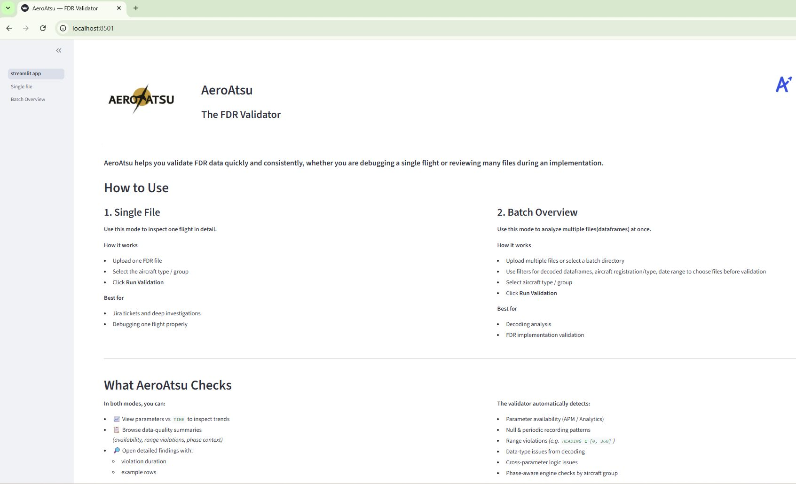
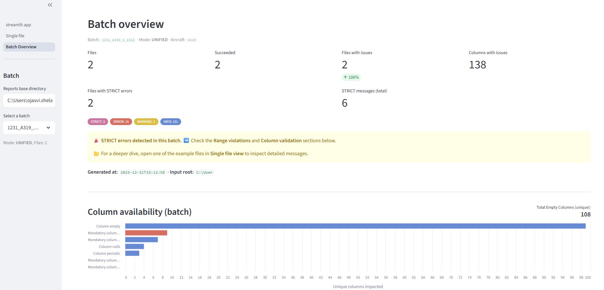

# AeroAtsu ✈️

A modular Python framework automating Flight Data Recorder (FDR) data quality checks 
for airline onboarding at OpenAirlines.

> 📄 Internship report available in this repo

---

## How AeroAtsu Works

  
   

  
   
  <em> Batch Overview validation interface : data quality KPIs across multiple FDR files</em>

